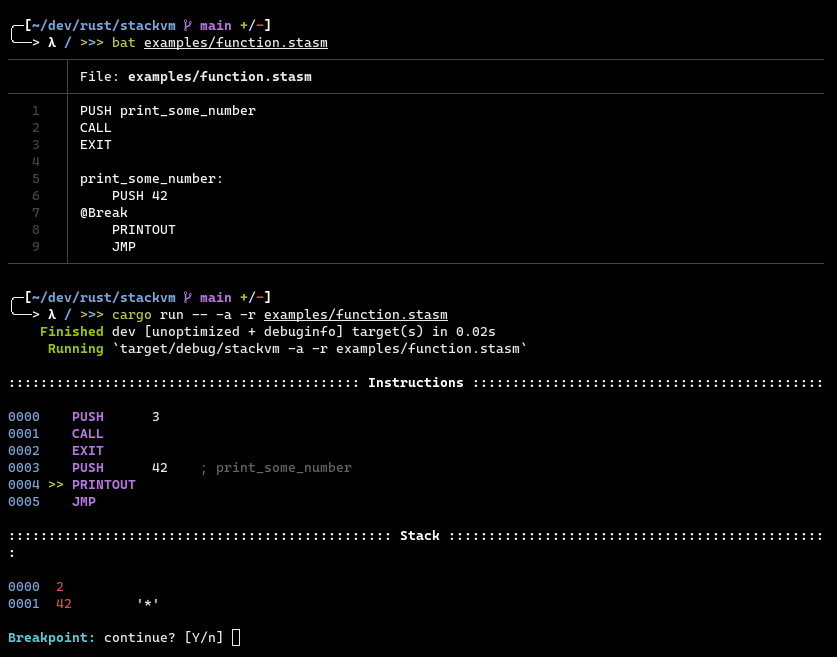

# StackVM

A stack-based virtual-machine and assembler written in Rust



## Compiling

Compile `stackvm` using `cargo`:

```console
$ cargo build --release
$ cp target/release/stackvm ./stackvm
```

## Usage

1. Assemble a `.stasm` file:
    ```console
    $ ./stackvm -a <.stasm file> -o <.bin output file>
    ```

2. Run a `.bin` file:
   ```console
   $ ./stackvm -r <.bin file>
   ```

3. Assemble and run a `.stasm` file:
   ```console
   $ ./stackvm -a -r <.stasm file>
   ```

## License

This code is licensed under the MIT License. See [LICENSE](./LICENSE) for more information.
